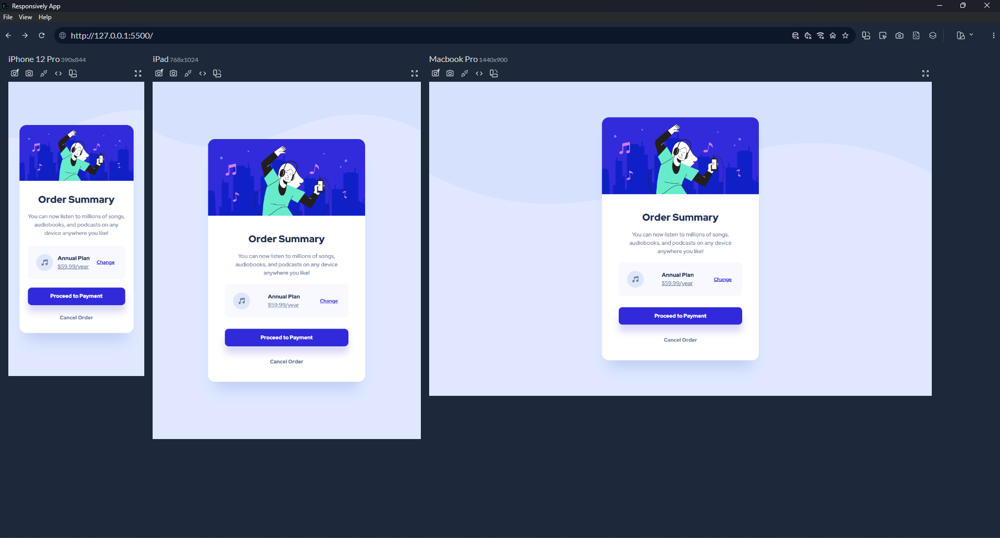

# Frontend Mentor - Order summary card solution

This is a solution to the [Order summary card challenge on Frontend Mentor](https://www.frontendmentor.io/challenges/order-summary-component-QlPmajDUj). Frontend Mentor challenges help you improve your coding skills by building realistic projects. 

## Table of contents

- [Overview](#overview)
  - [The challenge](#the-challenge)
  - [Screenshot](#screenshot)
  - [Links](#links)
- [My process](#my-process)
  - [Built with](#built-with)
  - [What I learned](#what-i-learned)
  - [Continued development](#continued-development)
  - [Useful resources](#useful-resources)
- [Author](#author)
- [Acknowledgments](#acknowledgments)


## Overview

### The challenge

Users should be able to:

- See hover states for interactive elements

### Screenshot





### Links

- Solution URL: [link](https://your-solution-url.com)
- Live Site URL: [link](https://ordersummarycomponents.netlify.app/)

## My process

### Built with

- Semantic HTML5 markup
- CSS custom properties
- Flexbox
- Mobile-first workflow


### What I learned


```html
<picture>
      <source 
        srcset="./images/pattern-background-mobile.svg"
        media="(max-width: 450px)"
      />

      
    </picture>
```
```css
.background__image {
  position: absolute;
  left: 0;
  top: 0;
  transform: translateY(-20%);
  width: 100%;
  z-index: -1;
}

```

### Continued development

In the future, I'll prioritize using Sass or Tailwind CSS and following best practices for enhanced web development.

### Useful resources

- [flexbox](https://flexbox.malven.co/) - This helped me for flex box. I really liked this website and will use it going forward.
- [Css Reference](https://cssreference.io/) - This is an amazing website. I'd recommend it to anyone still learning css.


## Author

- Frontend Mentor - [@yourusername](https://www.frontendmentor.io/profile/yourusername)
- Twitter - [@yourusername](https://www.twitter.com/yourusername)

**Note: Delete this note and add/remove/edit lines above based on what links you'd like to share.**

## Acknowledgments

This is where you can give a hat tip to anyone who helped you out on this project. Perhaps you worked in a team or got some inspiration from someone else's solution. This is the perfect place to give them some credit.

**Note: Delete this note and edit this section's content as necessary. If you completed this challenge by yourself, feel free to delete this section entirely.**
